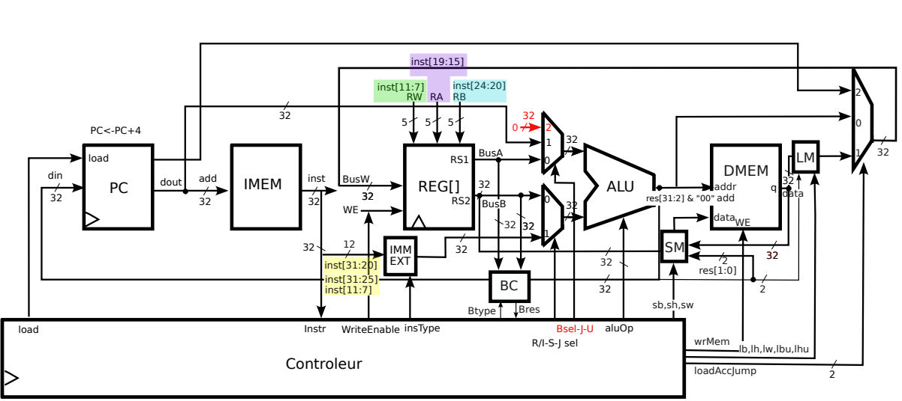

# RISC-V RV32I Single-Cycle Processor (VHDL)


A complete VHDL implementation of a **Single-Cycle RISC-V 32-bit (RV32I)** processor. 
This project implements the base integer instruction set, including memory management, conditional branching, and complex jump linking logic.

## 🚀 Features

* **Architecture:** 32-bit Single-Cycle Harvard Architecture (Separate Instruction and Data memory).
* **Instruction Set Support (RV32I):**
    * **R-Type:** Arithmetic and Logic (`ADD`, `SUB`, `AND`, `OR`, `XOR`, `SLL`, `SRL`, `SRA`, `SLT`, `SLTU`).
    * **I-Type:** Immediate operations (`ADDI`, `ANDI`, `ORI`...) and Loads (`LB`, `LH`, `LW`).
    * **S-Type:** Stores with Byte/Half-word granularity (`SB`, `SH`, `SW`).
    * **B-Type:** Conditional Branching (`BEQ`, `BNE`, `BLT`, `BGE`, `BLTU`, `BGEU`).
    * **J-Type:** Unconditional Jumps with Link (`JAL`).
    * **U-Type:** Upper Immediate operations (`LUI`, `AUIPC`).
    * **Indirect Jumps:** `JALR` with full support for return address linking.
* **Memory Management:** Custom Load/Store managers (`lm.vhd`, `sm.vhd`) handling Little Endian alignment and sign extension for sub-word accesses.

## 📂 Project Structure

### Core Components
* **`RISCV_RISB.vhd`**: Top-Level Entity connecting all components.
* **`ir_dec_risb.vhd`**: Main Instruction Decoder. Manages control signals based on Opcode/Funct3/Funct7.
* **`alu.vhd`**: Arithmetic Logic Unit.
* **`regbank.vhd`**: 32x32-bit Register File (`x0` hardwired to 0).
* **`compteur.vhd`**: Program Counter (PC) with `PC+4` output for linking.

### Control & Datapath Extensions
* **`bc.vhd` (Branch Controller):** Dedicated unit for comparing operands during B-Type instructions.
* **`imm_ext_risb.vhd`**: Immediate Extender handling bit-shuffling for S, B, J, and U formats.
* **`mux_opa.vhd`**: Multiplexer for ALU Input A (Selects between `Rs1`, `PC`, or `Zero`).
* **`mux_wb.vhd`**: Write-Back Multiplexer (Selects between `ALU Result`, `Memory Output`, or `PC+4`).
* **`imem.vhd` / `dmem.vhd`**: Instruction and Data Memories.



## 🛠️ Simulation with ModelSim

This project is optimized for simulation using **ModelSim (Intel FPGA Edition)**.

### 1. Compilation Order
VHDL requires compiling files in dependency order. Follow this sequence:
1.  `constants.vhd` (Essential definitions)
2.  Sub-components: `alu.vhd`, `regbank.vhd`, `bc.vhd`, `mux...`, `sm.vhd`, `lm.vhd`, etc.
3.  `RISCV_RISB.vhd` (Top Level)
4.  `RISCV_RISB_tb.vhd` (Testbench)

### 2. Running the Simulation
Use the following TCL commands in ModelSim to avoid "No Data" optimization errors:

```tcl
# 1. compile all files
vcom -work work *.vhd

# 2. Start simulation with optimization arguments enabled
vsim -voptargs=+acc work.RISCV_RISB_tb

# 3. Add signals to waveform
add wave -r /*

# 4. Run
run -all